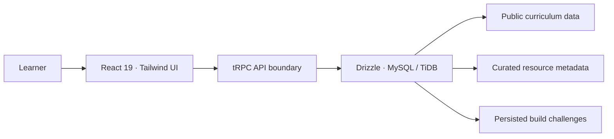
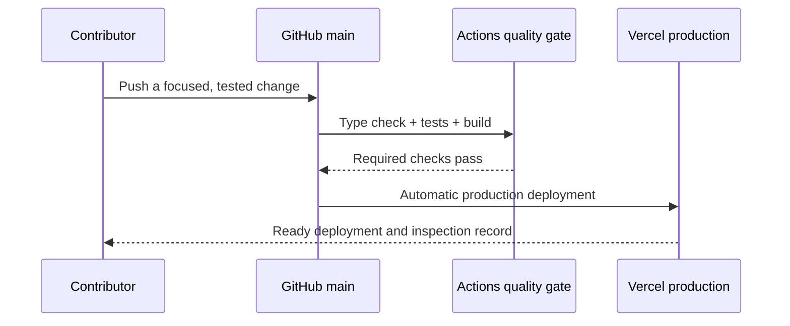

<div align="center">

# The Data Tea · AI Automation Roadmap

### A full-stack n8n learning product for building useful, reliable AI workflows

[](https://ai-automation-roadmap-git-main-sohila-khaled-abbas-projects.vercel.app)
[](https://github.com/Sohila-Khaled-Abbas/ai-automation-roadmap/actions/workflows/ci.yml)
[](https://www.typescriptlang.org/)
[](https://n8n.io/)

[](https://react.dev/)
[](https://trpc.io/)
[](https://orm.drizzle.team/)
[](https://www.mysql.com/)
[](./LICENSE)

<p>
  <a href="#learning-experience">Learning experience</a> ·
  <a href="#architecture">Architecture</a> ·
  <a href="#local-development">Local development</a> ·
  <a href="#quality-and-delivery">Quality & delivery</a> ·
  <a href="#github-maintenance">GitHub maintenance</a> ·
  <a href="#contributing">Contributing</a>
</p>

</div>

> **Make AI automation useful.** The Data Tea turns n8n learning into a practical, end-to-end process: learners prepare a workspace, understand automation opportunities, connect data, build reliable systems, add bounded AI, design agents, and ship a portfolio-ready capstone.

## Project status

| Signal | Current state | What it means |
| --- | --- | --- |
| **Production** | [Vercel deployment](https://ai-automation-roadmap-git-main-sohila-khaled-abbas-projects.vercel.app) | Pushes to `main` are deployed automatically. |
| **Quality gate** | Type check · Vitest · production build | Every release runs the same verification workflow before deployment. |
| **Curriculum** | 10-week process · 9 checkpoints | The visual route spans preparation through capstone delivery. |
| **Learning library** | 264 source-labeled references | Public n8n, MDN, OpenAI, YouTube, and Gemini Notebook references, including verified direct video upgrades. |
| **Build studio** | 7 persisted project challenges | Stage-mapped projects with proof criteria and direct official n8n template or guide references. |
| **Public field kit** | No sign-in required | Route completion is stored in the current browser and can be downloaded or printed as a portable field note. |

## Learning experience

The roadmap is deliberately project-led. Each stage pairs a measurable deliverable with source-labeled learning resources, so learners can move from understanding a process to showing a credible automation outcome.

| Stage | Focus | Learner artifact |
| --- | --- | --- |
| `00 / Prepare` | Practice system, safe workspace, problem selection | Learning brief and build rhythm |
| `01 / Orient` | Automation opportunities and process maps | Automation opportunity map |
| `02 / Connect` | APIs, webhooks, credentials, structured data | Webhook-to-sheet intake |
| `03 / Build` | Nodes, branches, error paths, reuse | Multi-step n8n workflow |
| `04 / Shape` | Data mapping, expressions, transformations | Data contract and validation rules |
| `05 / Augment` | Bounded AI and human review | AI-assisted workflow with review gate |
| `06 / Operate` | Logging, retries, handover, observability | Production-ready workflow handover |
| `07 / Agent` | Memory, tools, evaluation, escalation | Context-aware agent design |
| `08 / Capstone` | Deployment, debugging, evidence, portfolio | Demo-ready workflow and case study |

<details open>
<summary><strong>What learners can do</strong></summary>

Learners can filter the public library by type, including videos, guides, Notebook selections, courses, templates, and references. Route-stop completion remains on the current device, and the field kit can export or print a portable route note. Source-backed project or resource suggestions use the repository’s public GitHub content-proposal template rather than an in-app account form.

</details>

## Architecture



| Layer | Responsibility | Key locations |
| --- | --- | --- |
| **Client** | Learning route, library filters, learner workspace, accessible interactions | `client/src/` |
| **API** | Typed public curriculum, resource, and project procedures | `server/routers.ts` |
| **Domain logic** | Isolated validation and learning-route helpers | `server/*.ts` |
| **Persistence** | Schema, migrations, learner data, resource records, build challenges | `drizzle/`, `server/db.ts` |
| **Public progress** | Browser-local completion markers and portable route-note export | `client/src/lib/localRoadmapProgress.ts` |
| **Documentation** | Resource provenance, validation notes, contribution standards | `docs/`, `CONTRIBUTING.md` |

## Technology toolkit

<p align="center">
  <a href="https://react.dev/"></a>
  <a href="https://www.typescriptlang.org/"></a>
  <a href="https://tailwindcss.com/"></a>
  <a href="https://trpc.io/"></a>
  <a href="https://orm.drizzle.team/"></a>
  <a href="https://vitest.dev/"></a>
</p>

## Local development

Use **Node.js 22+** and **pnpm 10+**. Managed runtime variables provide the database configuration used by the content catalogue. Do not commit `.env` files, credentials, or learner data.

```bash
pnpm install
pnpm dev
```

| Command | Purpose |
| --- | --- |
| `pnpm dev` | Start the full-stack development server with watch mode. |
| `pnpm check` | Run the TypeScript compiler without emitting files. |
| `pnpm test` | Run the Vitest suite. |
| `pnpm build` | Create the production client and server bundles. |
| `pnpm run quality` | Run type checks, tests, and the production build together. |
| `pnpm format` | Apply Prettier formatting. |
| `pnpm format:check` | Verify formatting without modifying files. |

## Database and storage discipline

> **Schema-first principle:** update `drizzle/schema.ts`, generate and review migration SQL, apply it through the managed migration workflow, and keep the schema, migration history, and deployed database aligned.

The database stores curated resource metadata and stage-mapped build challenges. Public route completion is deliberately stored only in the learner’s browser and can be downloaded as a field note. Never store file bytes in database columns, collect unneeded personal data, or present browser-local completion as account-synced progress.

## Quality and delivery

The repository uses GitHub Actions as its quality baseline. The continuous-delivery path is intentionally simple and auditable:



The project is connected to Vercel with `main` as the production branch. Each synchronized main-branch checkpoint becomes a GitHub commit and triggers an automatic Vercel production build.

> **Production data check:** an externally hosted Vercel function must have the same protected database, OAuth, and storage environment configuration as the runtime used to seed the learner data. A successful homepage is not sufficient; verify the public resource and build-project endpoints contain expected records. See the [release runbook](./docs/release-runbook.md).

## GitHub maintenance

The repository includes issue templates, a pull-request checklist, a security-reporting policy, and a release runbook. These artifacts keep design changes, content additions, migrations, and production verification reviewable and reproducible.

| Document | Use it when |
| --- | --- |
| [GitHub maintenance guide](./docs/github-maintenance.md) | Reviewing repository areas, triaging issues, or maintaining source-backed learning content. |
| [Release runbook](./docs/release-runbook.md) | Verifying a GitHub commit, Vercel deployment, public API routes, or protected environment boundary. |
| [Contributing guide](./CONTRIBUTING.md) | Opening a focused implementation pull request. |
| [Security policy](./SECURITY.md) | Reporting a potential auth, storage, database, or secret issue privately. |

## Contribution contract

Read [CONTRIBUTING.md](./CONTRIBUTING.md) before changing the application. Keep changes small and reviewable, write tests for isolated server behavior, preserve responsive and keyboard-friendly UI patterns, and run `pnpm run quality` before opening a pull request.

Curated resources must retain a clear provider and source label. Never add fabricated reviews, ratings, testimonials, learner activity, or unverified outcome claims.

## Resource provenance

The public library combines official n8n documentation, MDN and OpenAI references, curated YouTube lessons, and selected Gemini Notebook sources. The research trail is available in [resource research notes](./docs/resource-research.md) and [learning-process research](./docs/learning-process-research.md).

---

<div align="center">

**Built as a project-led learning experience for practical automation builders.**

[](https://linkedin.com/in/sohilakabbas)
[](https://sohilakhaled-portfolio.lovable.app)
[](mailto:sohila.k.data@gmail.com)

</div>
